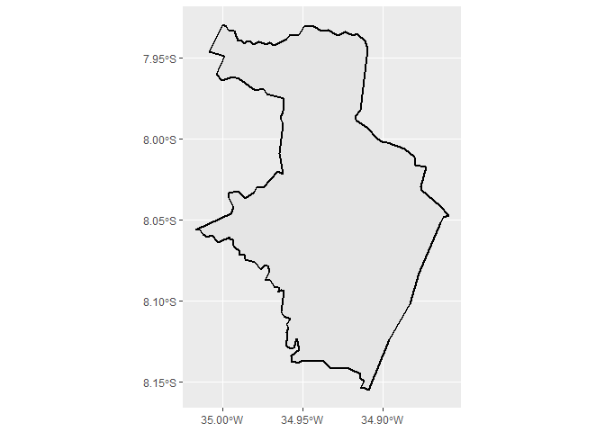
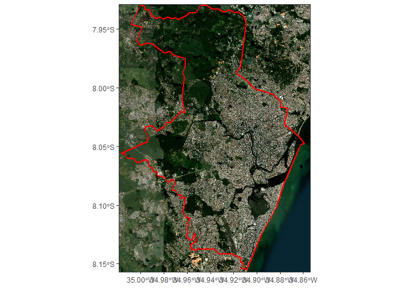

Our first step is to library the required packages:

- We use [geobr](https://github.com/ipeaGIT/geobr) package to download
  our area shapefile, Recife municipality, Pernambuco’s capital;

- We use [tidyverse](https://www.tidyverse.org/packages) to trate and
  filter our shapefile, to get only Recife area feature;

- We use
  [maptiles](https://github.com/riatelab/maptilesmaptiles%20Github%20page)
  package to download our satellite image, onde raster class;

- We use [tidyterra](https://dieghernan.github.io/tidyterra) package to
  visualizing multicolar raster throught ggplot;

- We use [terra](https://github.com/ipeaGIT/geobr) package to export our
  downloaded raster.

# Packages

``` r
library(geobr)

library(tidyverse)

library(maptiles)

library(tidyterra)

library(terra)
```

# Base Shapefile

## Importing

First, lets to download a brazilian municipalities shapefile throught
`geobr::read_municipality()` and use `dplyr::filter()` to get only
Recife feature.

``` r
recife <- geobr::read_municipality(year = 2019) |> 
  dplyr::filter(name_muni == "Recife")
```

    ## Using year/date 2019

## Visualizing

Next, lets vicualize our base shapefile, using a ggplot plot.

``` r
recife
```

    ## Simple feature collection with 1 feature and 7 fields
    ## Geometry type: MULTIPOLYGON
    ## Dimension:     XY
    ## Bounding box:  xmin: -35.0167 ymin: -8.155148 xmax: -34.859 ymax: -7.929199
    ## Geodetic CRS:  SIRGAS 2000
    ##   code_muni name_muni code_state abbrev_state name_state code_region name_region
    ## 1   2611606    Recife         26           PE Pernambuco           2    Nordeste
    ##                             geom
    ## 1 MULTIPOLYGON (((-34.89675 -...

``` r
ggplot() +
  geom_sf(data = recife, color = "black", linewidth = 1)
```

<!-- -->

# Satellite image

## Downloading

Now, our next step is to download our satellite raster, to Recife’s
area. We use `maptiles::get_tiles()`, informing:

- Our shapefile to use as base area (`x`);

- Which imagery we want to use (`provider`). `"Esri.WorldImagery"` let
  us to use a raster such as Google Earth. Check [maptiles Github
  page](https://github.com/riatelab/maptilesmaptiles%20Github%20page) to
  see more imageries options;

- Zoom (`zoom`), to set how resoluted the raster let be. See
  [OpenStreetMap wiki](https://wiki.openstreetmap.org/wiki/Zoom_levels)
  for details.

``` r
image <- maptiles::get_tiles(x = recife,
                              provider = "Esri.WorldImagery",
                              zoom = 16)
```

    ## |---------|---------|---------|---------|=========================================                                          |---------|---------|---------|---------|=========================================                                          |---------|---------|---------|---------|=========================================                                          |---------|---------|---------|---------|=========================================                                          |---------|---------|---------|---------|=========================================                                          

## Visualizing

Finaly, we obtained our satellite raster, using
`tidyterra::geom_spatraster_rgb()` to load and visualize the colored
raster. Check [tidyterra](https://dieghernan.github.io/tidyterra) for
details.

``` r
image
```

    ## class       : SpatRaster 
    ## size        : 10725, 7737, 3  (nrow, ncol, nlyr)
    ## resolution  : 2.13e-05, 2.13e-05  (x, y)
    ## extent      : -35.01892, -34.85412, -8.15712, -7.928677  (xmin, xmax, ymin, ymax)
    ## coord. ref. : lon/lat SIRGAS 2000 (EPSG:4674) 
    ## source      : spat_6a5c7b0a689f_27228_iAd7SUlxZLsaoD1.tif 
    ## colors RGB  : 1, 2, 3 
    ## names       : Esri.World~93_34216_1, Esri.World~93_34216_2, Esri.World~93_34216_3 
    ## min values  :                     0,                     0,                     0 
    ## max values  :                   255,                   255,                   255

``` r
ggplot() +
  tidyterra::geom_spatraster_rgb(data = image) +
  geom_sf(data = recife, fill = "transparent", color = "red", linewidth = 1) +
  scale_x_continuous(expand = c(0, 0)) +
  scale_y_continuous(expand = c(0, 0)) +
  theme_bw()
```

    ## <SpatRaster> resampled to 500633 cells.

<!-- -->

## Exporting

To the end, we go to export our raster, mainly to do not be necessary
download our satellite image again, using `terra::writeRaster()`

``` r
image |>
  terra::writeRaster("recife_image.tif")
```

    ## |---------|---------|---------|---------|=========================================                                          
